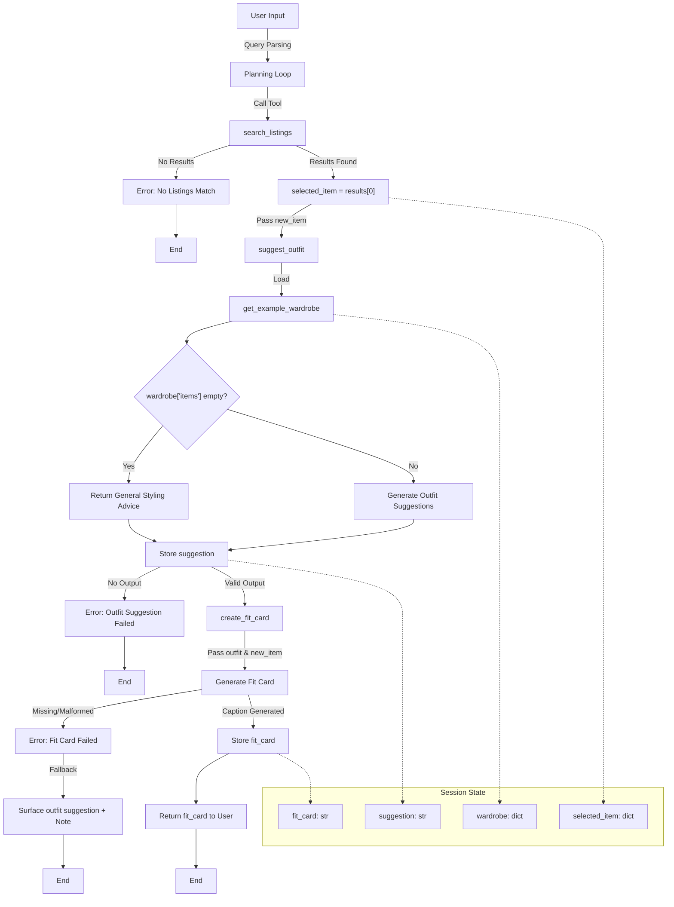

# FitFindr — planning.md

> Complete this document before writing any implementation code.
> Your spec and agent diagram are what you'll use to direct AI tools (Claude, Copilot, etc.) to generate your implementation — the more specific they are, the more useful the generated code will be.
> Your planning.md will be reviewed as part of your submission.
> Update it before starting any stretch features.

---

## Tools

List every tool your agent will use. For each tool, fill in all four fields.
You must have at least 3 tools. The three required tools are listed — add any additional tools below them.

### Tool 1: search_listings

**What it does:**
<!-- Describe what this tool does in 1–2 sentences -->

Searches listings.json for items matching the user's query and returns the top matching listings. Relevance is scored by keyword overlap between the description parameter and the listing's fields, with optional filtering by size and max_price applied first.

**Input parameters:**
<!-- List each parameter, its type, and what it represents -->
- `description` (str):  A brief name or description of the item the user is looking for, extracted from their query (e.g. "vintage graphic tee").
- `size` (str): The size the user is looking for, which could be a single letter (e.g. "M") or a formatted size like "US 7" or "W30". If the user does not specify a size, this is None and size filtering is skipped.
- `max_price` (float): The maximum price the user is willing to pay, used as an inclusive cap, the tool keeps listings where price <= max_price and skips any above it. Originally considered as an exclusive cap, but updated to inclusive after confirming against the provided test (assert all(item["price"] <= 10 for item in results)). To handle queries like "under $30", the agent converts the user's stated limit to 29.99 at query parsing time, so $30.00 listings fall outside the cap naturally without changing the tool's behavior.

**What it returns:**
<!-- Describe the return value — what fields does a result contain? -->
A list of the top 3 matching listing dicts sorted by relevance score (highest first), where each dict contains: id, title, description, category, style_tags, size, condition, price, colors, brand, and platform. Returns an empty list if nothing matches and does not raise an exception.

**What happens if it fails or returns nothing:**
<!-- What should the agent do if no listings match? -->
The agent stops immediately, does not call suggest_outfit, and returns an error message to the user explaining that no listings matched their query and suggesting they broaden their description, adjust their size, or raise their max price. /\|

---

### Tool 2: suggest_outfit

**What it does:**
<!-- Describe what this tool does in 1–2 sentences -->
Takes the top listing returned from search_listings and the user's wardrobe loaded via get_example_wardrobe(), and uses an LLM to generate 1–2 outfit suggestions pairing the new item with existing wardrobe pieces. If the wardrobe is empty, the LLM provides general styling advice for the item instead.

**Input parameters:**
<!-- List each parameter, its type, and what it represents -->
- `new_item` (dict): The top listing dict selected from the results returned by search_listings, containing fields like title, style_tags, colors, category, and price.
- `wardrobe` (dict): The user's wardrobe loaded via get_example_wardrobe() from data_loader.py, which returns the pre-populated mock wardrobe from wardrobe_schema.json for this demo. Contains an items list where each item has id, name, category, colors, style_tags, and notes.

**What it returns:**
<!-- Describe the return value -->
A non-empty string with outfit suggestions. If the wardrobe is empty, returns general styling advice for the item rather than specific outfit combinations.

**What happens if it fails or returns nothing:**
<!-- What should the agent do if the wardrobe is empty or no outfit can be suggested? -->
If wardrobe['items'] is empty — as would be the case with get_empty_wardrobe() — the tool falls back to general styling advice for the item rather than specific outfit combinations. If the tool returns nothing, the agent stops, does not call create_fit_card, and returns an error message telling the user the outfit suggestion failed and asking them to resubmit.
---

### Tool 3: create_fit_card

**What it does:**
<!-- Describe what this tool does in 1–2 sentences -->
Takes the styling suggestion string from suggest_outfit and the top listing dict from search_listings and uses an LLM to generate a short, casual 2–4 sentence caption in the style of a social media post, mentioning the item name, price, and platform naturally.

**Input parameters:**
<!-- List each parameter, its type, and what it represents -->
- `outfit` (str): The styling suggestion string returned from suggest_outfit, describing which wardrobe items pair with the new listing and how to style the look.
- `new_item` (dict): The top listing dict from search_listings, used to pull details like title, price, platform, and condition for the fit card.

**What it returns:**
<!-- Describe the return value -->
A 2–4 sentence string usable as a social media caption that is casual and authentic in tone, specific about the outfit vibe, and worded differently each time for different inputs. If outfit is empty or missing, returns a descriptive error message string instead of raising an exception.

**What happens if it fails or returns nothing:**
<!-- What should the agent do if the outfit data is incomplete? -->
The agent stops, skips the fit card, surfaces the outfit suggestion string from Step 2 directly to the user, and notes that the fit card could not be generated. 

---

### Additional Tools (if any)

<!-- Copy the block above for any tools beyond the required three -->

---

## Planning Loop

**How does your agent decide which tool to call next?**
<!-- Describe the logic your planning loop uses. What does it look at? What conditions change its behavior? How does it know when it's done? -->

After parsing the user's query, the agent calls search_listings first. If results is empty, the agent sets an error message in the session and returns early; telling the user to broaden their description, adjust size, or raise their max price, and suggest_outfit is never called. If results is not empty, the agent sets selected_item = results[0] and calls suggest_outfit(new_item=selected_item, wardrobe=get_example_wardrobe()). If suggest_outfit returns nothing, the agent sets an error message and returns early; prompting the user to rephrase their wardrobe, and create_fit_card is never called. If suggest_outfit returns a valid string, the agent calls create_fit_card(outfit=<suggestion>, new_item=selected_item). Once create_fit_card returns, the loop exits and the agent presents the full output to the user. A max iteration cap is also in place to force an exit if the loop runs longer than expected.

---

## State Management

**How does information from one tool get passed to the next?**
<!-- Describe how your agent stores and accesses state within a session. What data is tracked? How is it passed between tool calls? -->

The agent tracks four pieces of state across the tool calls within a session. First, after search_listings runs, the agent stores results and sets selected_item = results[0] — this dict is passed as new_item to both suggest_outfit and create_fit_card. Second, after suggest_outfit runs, the agent stores the returned suggestion string and passes it as outfit to create_fit_card. Third, the wardrobe is loaded once via get_example_wardrobe() at the start of the suggest_outfit call and is not stored beyond that. Fourth, after create_fit_card runs, the agent stores the returned fit card string as the final output — if it is missing or malformed, the agent falls back to surfacing the suggestion string from suggest_outfit directly. All four values — selected_item, suggestion, wardrobe, and fit_card — are held as local variables in the planning loop and passed directly between tool calls rather than written to any external store.

---

## Error Handling

For each tool, describe the specific failure mode you're handling and what the agent does in response.

| Tool | Failure mode | Agent response |
|------|-------------|----------------|
| search_listings | No results match the query | The agent stops immediately, does not call suggest_outfit, and returns an error message telling the user no listings matched and suggesting they broaden their description, adjust their size, or raise their max price.|
| suggest_outfit | Wardrobe is empty | The agent does not stop, instead suggest_outfit falls back to returning general styling advice for the item rather than specific outfit combinations, and the agent continues to create_fit_card. |
| create_fit_card | Outfit input is missing or incomplete | The agent skips the fit card, surfaces the outfit suggestion string from suggest_outfit directly to the user, and notes that the fit card could not be generated. |

---

## Architecture

<!-- Draw a diagram of your agent showing how the components connect:
     User input → Planning Loop → Tools (search_listings, suggest_outfit, create_fit_card)
                                                                          ↕
                                                                   State / Session
     Show what triggers each tool, how state flows between them, and where error paths branch off.
     ASCII art, a Mermaid diagram (https://mermaid.js.org/syntax/flowchart.html), or an embedded
     sketch are all fine. You'll share this diagram with an AI tool when asking it to implement
     the planning loop and each individual tool. -->

---

## AI Tool Plan

<!-- For each part of the implementation below, describe:
     - Which AI tool you plan to use (Claude, Copilot, ChatGPT, etc.)
     - What you'll give it as input (which sections of this planning.md, your agent diagram)
     - What you expect it to produce
     - How you'll verify the output matches your spec before moving on

     "I'll use AI to help me code" is not a plan.
     "I'll give Claude my Tool 1 spec (inputs, return value, failure mode) and ask it to implement
     search_listings() using load_listings() from the data loader — then test it against 3 queries
     before trusting it" is a plan. -->

**Milestone 3 — Individual tool implementations:**

For each tool, I'll primarily use Claude, giving it the spec block for that tool from this planning.md, one tool at a time, including the input parameters, return value, and failure mode. I'll ask it to implement each function in tools.py using load_listings() and get_example_wardrobe() from data_loader.py rather than re-implementing file loading. Before moving on, I'll test each generated function against at least 3 queries and verify the output matches my spec; checking that parameters are handled correctly, failure modes return the right thing, and no exceptions are raised when they shouldn't be. If results look off, I'll compare with Copilot for a second opinion or use it for inline fixes. I'll also update descriptions in this planning.md based on anything that changes during debugging, such as decisions around wardrobe_schema usage or edge cases that weren't accounted for.

**Milestone 4 — Planning loop and state management:**

I'll give Claude the Planning Loop and State Management sections of this planning.md along with the agent architecture diagram and ask it to implement the loop in agent.py. I'll verify that selected_item, suggestion, and fit_card are correctly passed between tool calls, that all early exit conditions trigger the right error messages, and that the max iteration cap is in place and tested. Additional focus will go toward edge cases like what happens when a tool returns an unexpected type or when the loop hits the iteration cap before completing.

---

## A Complete Interaction (Step by Step)

Write out what a full user interaction looks like from start to finish — tool call by tool call. Use a specific example query.

**Example user query:** "I'm looking for a vintage graphic tee under $30. I mostly wear baggy jeans and chunky sneakers. What's out there and how would I style it?"

**Step 1:**
<!-- What does the agent do first? Which tool is called? With what input? -->
The agent parses the user's query and extracts search parameters, then calls search_listings("vintage graphic tee", size="M", max_price=29.99). The agent converts "under $30" to 29.99 at query parsing time; this is because search_listings uses an inclusive cap (price <= max_price), meaning a listing at exactly $30.00 would otherwise be included. Passing 29.99 excludes it naturally. This decision was confirmed after considering the provided test assert all(item["price"] <= 10 for item in results), which expects inclusive behavior from the tool itself. The tool returns up to 3 matching listings sorted by relevance, and the agent selects the top result.

**Step 2:**
<!-- What happens next? What was returned from step 1? What tool is called now? -->
The agent receives 3 matching listings sorted by relevance from Step 1 and picks the top result. It then calls suggest_outfit(new_item=<top_listing>, wardrobe=<user's wardrobe>). The wardrobe is loaded using get_example_wardrobe() from data_loader.py, which pulls the user's items from wardrobe_schema.json. The tool returns a styling suggestion based on the new item and the wardrobe items passed in.

**Step 3:**
<!-- Continue until the full interaction is complete -->
The agent calls create_fit_card(outfit=<suggest_outfit_result>, new_item=<top_listing>), passing both the styling suggestion returned from Step 2 and the top listing from Step 1. The tool formats these into a short caption-style fit card and returns it. If either input is missing or malformed, the agent skips the fit card, surfaces the outfit suggestion from Step 2 on its own, and notes that the card couldn't be generated.

**Final output to user:**
<!-- What does the user actually see at the end? -->
The agent presents all three outputs together: the top matching listing with its price, condition, and platform; the outfit suggestion with specific styling notes; and the generated fit card caption. If search_listings returned nothing at Step 1, the agent stops there, explains which filters likely caused no matches, and suggests loosening one of them; it does not call suggest_outfit with empty input.
