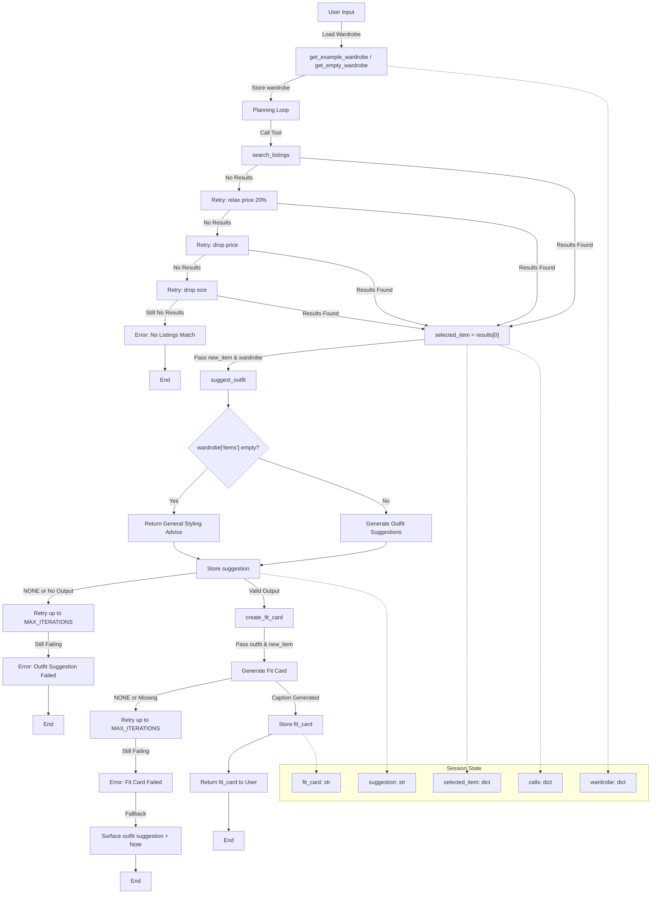

# FitFindr — planning.md

> Complete this document before writing any implementation code.
> Your spec and agent diagram are what you'll use to direct AI tools (Claude, Copilot, etc.) to generate your implementation — the more specific they are, the more useful the generated code will be.
> Your planning.md will be reviewed as part of your submission.
> Update it before starting any stretch features.

---

## Tools

List every tool your agent will use. For each tool, fill in all four fields.
You must have at least 3 tools. The three required tools are listed — add any additional tools below them.

### Tool 1: search_listings

**What it does:**
Searches `listings.json` for items matching the user's query and returns the top matching listings. Relevance is scored by keyword overlap between the `description` parameter and the listing's fields, with optional filtering by `size` and `max_price` applied first.

**Input parameters:**
- `description` (str): A brief name or description of the item the user is looking for, extracted from their query (e.g. "vintage graphic tee").
- `size` (str | None): The size the user is looking for, which could be a single letter (e.g. "M") or a formatted size like "US 7" or "W30". If the user does not specify a size, this is None and size filtering is skipped.
- `max_price` (float | None): The maximum price the user is willing to pay, used as an inclusive cap — the tool keeps listings where `price <= max_price` and skips any above it. Originally considered as an exclusive cap, but updated to inclusive after confirming against the provided test (`assert all(item["price"] <= 10 for item in results)`). The agent handles price phrasing at query parsing time using an LLM — exclusive phrasings like "under $30" are converted to 29.99, while inclusive phrasings like "$30 or under" or "up to $30" keep the number as-is.

**What it returns:**
A list of the top 3 matching listing dicts sorted by relevance score (highest first), where each dict contains: `id`, `title`, `description`, `category`, `style_tags`, `size`, `condition`, `price`, `colors`, `brand`, and `platform`. Returns an empty list if nothing matches — does not raise an exception.

**What happens if it fails or returns nothing:**
The agent retries progressively via `_search_with_fallback` before giving up, up to `MAX_SEARCH_FALLBACKS` (4) attempts. The order is: all filters → relax `max_price` by 20% (staying close to budget) → drop `max_price` entirely → drop `size` as a last resort. The number of fallback attempts is configurable — setting `MAX_SEARCH_FALLBACKS = 1` skips all relaxation. If all attempts return empty, the agent stops immediately, does not call `suggest_outfit`, and returns an error message telling the user to broaden their description, adjust their size, or raise their max price.

---

### Tool 2: suggest_outfit

**What it does:**
Takes the top listing returned from `search_listings` and the user's wardrobe loaded via `get_example_wardrobe()`, and uses an LLM to generate 1–2 outfit suggestions pairing the new item with existing wardrobe pieces. If the wardrobe is empty, the LLM provides general styling advice for the item instead.

**Input parameters:**
- `new_item` (dict): The top listing dict selected from the results returned by `search_listings`, containing fields like `title`, `style_tags`, `colors`, `category`, and `price`.
- `wardrobe` (dict): The user's wardrobe loaded via `get_example_wardrobe()` from `data_loader.py`, which returns the pre-populated mock wardrobe from `wardrobe_schema.json` for this demo. Contains an `items` list where each item has `id`, `name`, `category`, `colors`, `style_tags`, and `notes`.

**What it returns:**
A non-empty string with outfit suggestions. If the wardrobe is empty, returns general styling advice for the item rather than specific outfit combinations. Returns `'NONE'` if the LLM signals it cannot generate a valid suggestion.

**What happens if it fails or returns nothing:**
If `wardrobe['items']` is empty — as would be the case with `get_empty_wardrobe()` — the tool falls back to general styling advice for the item rather than specific outfit combinations. If the tool returns nothing or `'NONE'`, the agent retries up to `MAX_ITERATIONS` (3) times before stopping, setting an error message, and returning early without calling `create_fit_card`.

---

### Tool 3: create_fit_card

**What it does:**
Takes the styling suggestion string from `suggest_outfit` and the top listing dict from `search_listings` and uses an LLM to generate a short, casual 2–4 sentence caption in the style of a social media post, mentioning the item name, price, and platform naturally.

**Input parameters:**
- `outfit` (str): The styling suggestion string returned from `suggest_outfit`, describing which wardrobe items pair with the new listing and how to style the look.
- `new_item` (dict): The top listing dict from `search_listings`, used to pull details like `title`, `price`, `platform`, and `condition` for the fit card.

**What it returns:**
A 2–4 sentence string usable as a social media caption — casual and authentic in tone, specific about the outfit vibe, and worded differently each time for different inputs. If `outfit` is empty or missing, returns a descriptive error message string instead of raising an exception. Returns `'NONE'` if the LLM signals it cannot generate a valid caption.

**What happens if it fails or returns nothing:**
If the tool returns nothing or `'NONE'`, the agent retries up to `MAX_ITERATIONS` (3) times. If all attempts fail, the agent surfaces the outfit suggestion string from `suggest_outfit` directly to the user and notes that the fit card could not be generated.

---

### Additional Tools (if any)

<!-- Copy the block above for any tools beyond the required three -->

---

### Stretch Features

**Retry logic with fallback (implemented):**
If `search_listings` returns no results, the agent automatically retries with progressively relaxed constraints via `_search_with_fallback`. The order is: all filters → relax `max_price` by 20% → drop `max_price` entirely → drop `size` as a last resort. The number of fallback attempts is controlled by `MAX_SEARCH_FALLBACKS` (default 4) — setting it to 1 disables all relaxation, 2 allows only price relaxation, and so on. Size is preserved as long as possible since a great find at the wrong size is not useful. The user is informed via `session["search_note"]` if filters were relaxed. This directly implements the stretch feature described in the project spec.

---

## Planning Loop

**How does your agent decide which tool to call next?**

After the user's query is received, the agent first calls `_parse_query()` which uses an LLM to extract `description`, `size`, and `max_price` from the natural language input. The LLM handles exclusive phrasings like "under $30" by subtracting 0.01 (giving 29.99), and inclusive phrasings like "$50 or under" by keeping the number as-is. If the LLM returns malformed JSON, `_parse_query()` falls back to using the full query as the description with no filters.

The agent then calls `_search_with_fallback` which attempts `search_listings` up to `MAX_SEARCH_FALLBACKS` (4) times with progressively relaxed filters: first with all filters, then with `max_price` relaxed by 20% to stay close to the user's budget, then dropping `max_price` entirely while preserving `size`, and finally dropping both filters as a last resort. The number of fallback attempts is configurable — setting `MAX_SEARCH_FALLBACKS = 1` skips all relaxation. If all attempts return empty, the agent sets an error message and returns early — `suggest_outfit` is never called with empty input. Size is preserved as long as possible since a great find at the wrong size is not useful. If a relaxed search succeeds, `session["search_note"]` is set to inform the user which filters were adjusted.

If results are found, the agent sets `selected_item = results[0]` and calls `suggest_outfit`. Since `suggest_outfit` is LLM-based and can fail transiently (network timeout, rate limit) or return `'NONE'`, the agent retries up to `MAX_ITERATIONS` (3) times. If all attempts fail, the agent sets an error message and returns early — `create_fit_card` is never called.

If `suggest_outfit` returns a valid string, the agent calls `create_fit_card`. This is also LLM-based and retries up to `MAX_ITERATIONS` (3) times on failure or `'NONE'` response. If all attempts fail, the agent surfaces the outfit suggestion directly and notes the fit card could not be generated.

Once `create_fit_card` returns successfully, the loop exits and the agent presents the full output to the user. Each tool call is tracked in `session["calls"]` for debugging and transparency.

---

## State Management

**How does information from one tool get passed to the next?**

The agent tracks five pieces of state across the tool calls within a session. First, after `search_listings` runs, the agent stores `results` and sets `selected_item = results[0]` — this dict is passed as `new_item` to both `suggest_outfit` and `create_fit_card`. Second, after `suggest_outfit` runs, the agent stores the returned suggestion string and passes it as `outfit` to `create_fit_card`. Third, the wardrobe is passed in as a parameter to `run_agent()` and stored in `session["wardrobe"]` from the start via `_new_session()` — this supports both `get_example_wardrobe()` and `get_empty_wardrobe()` as selected by the user in the UI. Fourth, after `create_fit_card` runs, the agent stores the returned fit card string as the final output — if it fails after all retries, the agent surfaces the suggestion string from `suggest_outfit` directly. Fifth, `session["calls"]` tracks how many times each tool was called independently, including retries, for debugging and transparency. All values are held in the session dict and passed directly between tool calls rather than written to any external store.

---

## Error Handling

For each tool, describe the specific failure mode you're handling and what the agent does in response.

| Tool | Failure mode | Agent response |
|------|-------------|----------------|
| `search_listings` | No results match the query | The agent retries progressively via `_search_with_fallback` up to `MAX_SEARCH_FALLBACKS` (4) times: first relaxing `max_price` by 20%, then dropping `max_price` entirely, then dropping `size` as a last resort. If all attempts return empty, the agent stops immediately, does not call `suggest_outfit`, and returns an error message telling the user to broaden their description, adjust their size, or raise their max price. |
| `suggest_outfit` | Wardrobe is empty | The agent does not stop — instead `suggest_outfit` falls back to returning general styling advice for the item rather than specific outfit combinations, and the agent continues to `create_fit_card`. |
| `create_fit_card` | Outfit input is missing or incomplete | The agent skips the fit card, surfaces the outfit suggestion string from `suggest_outfit` directly to the user, and notes that the fit card could not be generated. |

---

## Architecture

---

## AI Tool Plan

**Milestone 3 — Individual tool implementations:**

For each tool, I'll primarily use Claude, giving it the spec block for that tool from this planning.md, one tool at a time, including the input parameters, return value, and failure mode. I'll ask it to implement each function in `tools.py` using `load_listings()` and `get_example_wardrobe()` from `data_loader.py` rather than re-implementing file loading. Before moving on, I'll test each generated function against at least 3 queries and verify the output matches my spec; checking that parameters are handled correctly, failure modes return the right thing, and no exceptions are raised when they shouldn't be. If results look off, I'll compare with Copilot for a second opinion or use it for inline fixes.

During implementation, query parsing was initially handled with regex but switched to LLM parsing after identifying that regex required anticipating every possible price phrasing. The LLM parser was also refined after testing revealed that "$50 or under" was incorrectly treated as exclusive — the prompt rules were updated explicitly. A `NONE` grounding instruction was also added to the `suggest_outfit` and `create_fit_card` prompts so the LLM signals failure explicitly rather than returning unhelpful text. The Groq client was also moved to `utils/groq_client.py` to avoid duplication across `tools.py` and `agent.py`, which directly addresses the separation of concerns feedback from the previous project.

**Milestone 4 — Planning loop and state management:**

I'll give Claude the Planning Loop and State Management sections of this planning.md along with the agent architecture diagram and ask it to implement the loop in `agent.py`. I'll verify that `selected_item`, `suggestion`, and `fit_card` are correctly passed between tool calls, that all early exit conditions trigger the right error messages, and that per-tool retry loops are in place for LLM-based tools. During implementation, `search_listings` was refactored into a separate `_search_with_fallback` helper function following the separation of concerns feedback from the previous project — this makes it independently testable and keeps `run_agent()` readable. The retry logic was improved from a single relaxed retry to a progressive 4-step relaxation: all filters → relax price 20% → drop price → drop size. `MAX_SEARCH_FALLBACKS` was also added as a configurable constant controlling how aggressively the agent relaxes search filters — setting it to 1 disables all relaxation while 4 enables all four progressive steps. `suggest_outfit` and `create_fit_card` each got their own `while` loop up to `MAX_ITERATIONS` (3) since LLM calls can fail transiently. `session["calls"]` was added to track how many times each tool was called independently for debugging.

---

## A Complete Interaction (Step by Step)

**Example user query:** "I'm looking for a vintage graphic tee under $30. I mostly wear baggy jeans and chunky sneakers. What's out there and how would I style it?"

**Step 1:**
The agent passes the user's query to `_parse_query()`, which uses an LLM to extract search parameters and calls `search_listings("vintage graphic tee", size=None, max_price=29.99)`. The LLM converts "under $30" to 29.99 because the phrasing is exclusive — `search_listings` uses an inclusive cap (`price <= max_price`), so passing 29.99 excludes $30.00 listings naturally. For inclusive phrasings like "$30 or under", the LLM keeps the number as-is. This approach was chosen over regex because it handles natural language variations without requiring us to anticipate every possible phrasing. The tool returns up to 3 matching listings sorted by relevance, and the agent selects the top result.

**Step 2:**
The agent receives 3 matching listings sorted by relevance from Step 1 and picks the top result. It then calls `suggest_outfit(new_item=<top_listing>, wardrobe=<user's wardrobe>)`. The wardrobe is loaded using `get_example_wardrobe()` from `data_loader.py`, which returns the pre-populated mock wardrobe from `wardrobe_schema.json`. The user's conversational description of their wardrobe ("baggy jeans and chunky sneakers") serves as additional context but is not parsed into the wardrobe dict directly. The tool returns a styling suggestion based on the new item and the wardrobe items passed in.

**Step 3:**
The agent calls `create_fit_card(outfit=<suggest_outfit_result>, new_item=<top_listing>)`, passing both the styling suggestion returned from Step 2 and the top listing from Step 1. The tool formats these into a short caption-style fit card and returns it. If either input is missing or the LLM returns `'NONE'`, the agent retries up to `MAX_ITERATIONS` times before surfacing the outfit suggestion from Step 2 on its own and noting that the card couldn't be generated.

**Final output to user:**
The agent presents all three outputs together: the top matching listing with its price, condition, and platform; the outfit suggestion with specific styling notes; and the generated fit card caption. If `search_listings` returned nothing at Step 1, even after all `MAX_SEARCH_FALLBACKS` progressive retry attempts, the agent stops there, explains which filters likely caused no matches, and suggests loosening one of them. It does not call `suggest_outfit` with empty input.